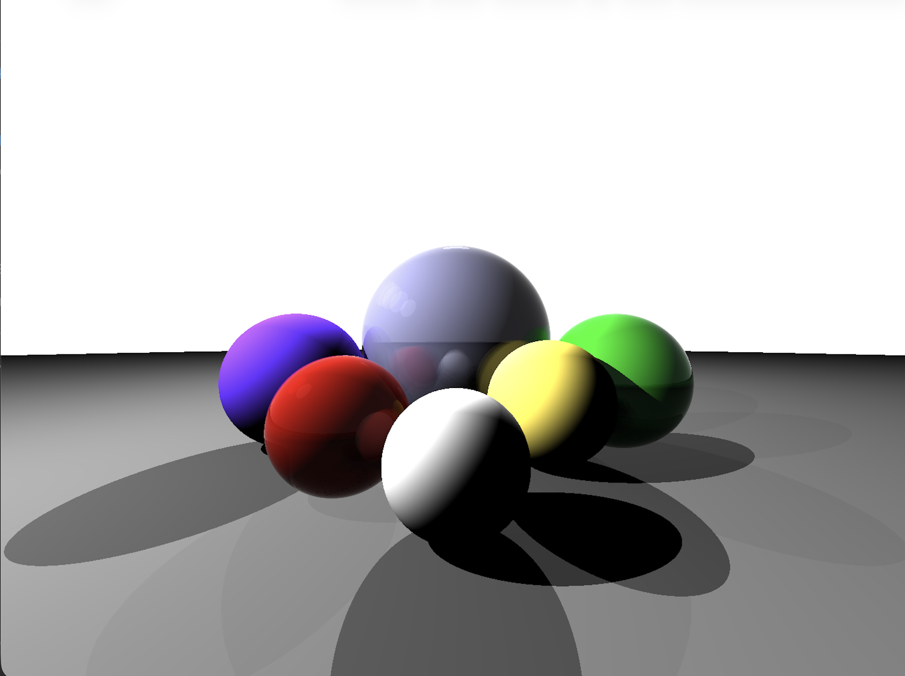

# Raytracer

A small C++ ray tracer that renders spheres with:
- diffuse shading
- emissive light spheres
- recursive reflections
- recursive refractions

The renderer writes a PPM image (`image.ppm`) and uses a simple pinhole camera plus ray-sphere intersections.

## Example Output



## Build

```bash
make
```

## Run

```bash
./raytracer
```

This generates `image.ppm` in the project root.